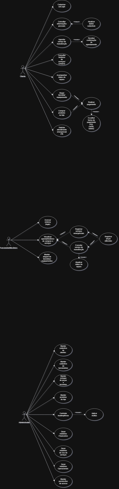

## 4. Diagrama de Caso de Uso
  

https://drive.google.com/file/d/1X3uBM3SXDDQSDBN9yO-RBLclI3A_SdEh/view?usp=sharing

## 4.1 Descrição de Caso de Uso

## 1º Caso de Uso: Alugar Bicicleta/Equipamento

**Ator Primário:** Cliente  
**Atores Secundários:** Sistema de Pagamento, Funcionário/Mecânico (opcional), Estoque  

### **Descrição**
Este caso de uso descreve o processo pelo qual o cliente seleciona uma bicicleta ou equipamento disponível para aluguel, verifica valores e datas, escolhe a forma de pagamento e conclui a reserva. O sistema confirma o aluguel, registra no estoque e disponibiliza o item para retirada.

### **Pré-condições**
- O cliente deve estar autenticado no sistema.  
- O item deve estar disponível no período desejado.  
- O sistema de pagamento deve estar funcional.

### **Pós-condições**
- A reserva de aluguel é registrada.  
- O item é marcado como indisponível para o período selecionado.  
- A operação é adicionada ao histórico do cliente.  
- Dependendo da configuração, o pagamento pode ser concluído automaticamente ou finalizado apenas no momento da retirada.

---

### **Fluxo Principal**
1. O cliente acessa o módulo **“Alugar bicicleta/equipamento”**.
2. O sistema exibe a lista de itens disponíveis, com modelos, preços e descrições.
3. O cliente seleciona uma bicicleta ou equipamento.
4. O sistema exibe detalhes do item e solicita o período desejado.
5. O cliente escolhe as datas de início e término do aluguel.
6. O sistema verifica a disponibilidade.
7. O cliente confirma o aluguel.
8. O sistema solicita a escolha da **forma de pagamento**.
9. O cliente seleciona entre: PIX, cartão ou boleto.
10. O sistema processa o pagamento (ou registra como pendente, conforme a política).
11. O sistema confirma a reserva e registra o aluguel.
12. O sistema atualiza o estoque e exibe uma mensagem de sucesso ao cliente.

---

### **Fluxos Alternativos**

#### **Item indisponível**
- O sistema informa que o item não está disponível no período selecionado.
- O cliente pode escolher outro item ou alterar as datas.

#### **Pagamento recusado**
- O sistema informa que a transação foi recusada.
- O cliente pode tentar outra forma de pagamento.

---

## 2º Caso de Uso: Visualizar Agenda / Histórico de Compras e Serviços

**Ator Primário:** Cliente  
**Atores Secundários:** Sistema de Agendamentos, Sistema de Compras, Sistema de Serviços

### **Descrição**
Este caso de uso descreve a ação do cliente ao acessar o sistema para visualizar seus agendamentos futuros, bem como o histórico completo de serviços realizados, produtos adquiridos e aluguéis efetuados. O sistema organiza e apresenta todas essas informações de forma clara e acessível.

### **Pré-condições**
- O cliente deve estar autenticado no sistema.  
- Os dados de histórico e agendamentos devem estar registrados no banco de dados.

### **Pós-condições**
- Nenhuma alteração é feita no sistema; trata-se apenas de visualização.  
- Os registros exibidos podem servir de base para outras ações do cliente.

---

### **Fluxo Principal**
1. O cliente acessa o módulo **“Histórico / Agenda”**.
2. O sistema exibe duas categorias:  
   - *Agendamentos futuros*  
   - *Histórico de serviços, compras e aluguéis*
3. O cliente seleciona a categoria desejada.
4. O sistema recupera os registros no banco de dados.
5. O sistema apresenta informações como:  
   - Data e hora dos agendamentos  
   - Tipo de serviço solicitado  
   - Produtos comprados  
   - Bicicletas e equipamentos alugados  
   - Status dos serviços (pendente, em execução, concluído)  
   - Valores pagos ou pendentes  
6. O cliente pode selecionar um item da lista para visualizar detalhes.
7. O sistema exibe todas as informações referentes ao registro selecionado.

---

### **Fluxos Alternativos**

#### **Nenhum histórico encontrado**
- O sistema exibe a mensagem: **“Nenhum registro encontrado no momento.”**  
- O cliente pode retornar ao menu principal ou realizar novas operações.

#### **Cliente não autenticado**
- O sistema redireciona para a tela de login.  
- Após a autenticação, retorna automaticamente ao módulo de histórico.
